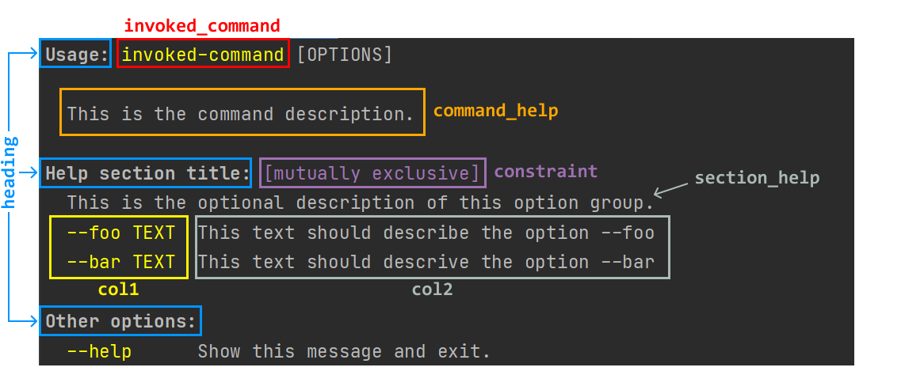

.. py:currentmodule:: cloup

Help formatting and theming
===========================

Formatting settings
-------------------

In Cloup we can distinguish two groups of formatting settings:

1. parameters of commands/mixins classes

   - ``align_option_groups`` -- see :ref:`here <aligned-vs-nonaligned-group>`;
   - ``align_sections`` -- similar to ``align_option_groups`` but for subcommand sections;
   - ``show_constraints`` -- whether to include the "Constraints" section
     (see :ref:`here <show-constraints>`);

   since v0.8, these parameters are also available as ``Context`` parameters.

2. parameters of the :class:`HelpFormatter`, including ``theme``
   (click on :class:`HelpFormatter` to see the full list);
   these parameters can be passed to both ``Context`` and commands using the
   parameter ``formatter_settings``, which is a dictionary.

In both cases, commands settings override context settings.
In the case of ``formatter_settings``, the final settings used by a command are
obtained by merging the dictionaries like following:
``{**ctx.formatter_settings, **command.formatter_settings}``.

Context settings propagate to subcommands, while command settings don't.

An example
~~~~~~~~~~

.. tip::
    In Cloup, you can use the static methods :meth:`Context.settings` and
    :meth:`HelpFormatter.settings` to create dictionaries without leaving your
    IDE (to check the docs).

.. code-block:: python

    from cloup import Context, command, group, HelpFormatter, HelpTheme

    CONTEXT_SETTINGS = Context.settings(
        align_option_groups=False,
        align_sections=True,
        show_constraints=True,
        formatter_settings=HelpFormatter.settings(
            max_width=100,
            max_col1_width=25,
            min_col2_width=30,
            indent_increment=3,
            col_spacing=3,
            row_sep='\n',
            theme=HelpTheme.light()
        )
    )

    @group(context_settings=CONTEXT_SETTINGS)
    # ...
    def main(...):
        ...

    # This command overrides some of CONTEXT_SETTINGS values
    @main.command(
        align_option_groups=True,
        formatter_settings=HelpFormatter.settings(
            max_col1_width=30,
        )
    )
    # ...
    def cmd(...):
        ...

Theming
-------
A :class:`HelpTheme` is a collection of styles for several elements of the help page.
A "style" is just a function (or a callable) that takes a string and returns a
styled version of it. This means you can use your favorite styling/color library
(like ``rich``, ``colorful`` etc) with it.

Given that Click has some built-in basic styling functionality provided by the
function :func:`click.style`, Cloup provides the :class:`~cloup.Style` class, which
wraps ``click.style`` to facilitate its use with ``HelpTheme``.

.. tip::
    Cloup also provides an *enum-like* class :class:`Color` containing all
    colors supported by Click.

The following picture links ``HelpTheme`` arguments to the corresponding visual
elements of the help page (only ``epilog`` is missing):

The above image was obtained with the following theme::

    HelpTheme(
        invoked_command=Style(fg='bright_yellow'),
        heading=Style(fg='bright_white', bold=True),
        constraint=Style(fg='magenta'),
        col1=Style(fg='bright_yellow'),
    )

For an always up-to-date list of all possible arguments these classes take,
refer to the API reference:

.. autosummary::
    HelpTheme
    Style

How to set a theme
~~~~~~~~~~~~~~~~~~

You must provide a ``theme`` as part of the ``formatter_settings`` dictionary,
as shown in `the example above <#an-example>`_.

Available themes (and how to override parts of them)
~~~~~~~~~~~~~~~~~~~~~~~~~~~~~~~~~~~~~~~~~~~~~~~~~~~~

Cloup provides two reasonable themes:

.. autosummary::
    HelpTheme.dark
    HelpTheme.light

You probably want to select a theme based on the terminal background color in use.
Nonetheless, Cloup doesn't currently provide a way to get it (any suggestions are
welcome).

If you want, you can use the default themes as a base and change only some of
the styles using :meth:`HelpTheme.with_`, e.g.:

.. code-block:: python

    theme = HelpTheme.dark().with_(
        col1=Style(fg=Color.bright_green),
        epilog=Style(fg=Color.bright_white, italic=True)
    )

The linear layout for definition lists
--------------------------------------
When the terminal width is "too small" for a standard 2-column definition lists,
Cloup ``HelpFormatter`` switches to a "linear layout", where

- the option description is always printed below the option name, with an indentation
  increment of at least 3 spaces
- all definitions are separated by an empty line.

The following tabs compare the ``--help`` of the manim example ("aligned" and
"non-aligned" refer to the ``align_option_groups`` argument):

.. tabbed:: Linear layout

    .. code-block:: none

        Usage: manim render [OPTIONS]
                            SCRIPT_PATH
                            [SCENE_NAMES]...

          Render some or all scenes defined in a Python
          script.

        Global options:
          -c, --config_file TEXT
             Specify the configuration file to use for
             render settings.

          --custom_folders
             Use the folders defined in the
             [custom_folders] section of the config
             file to define the output folder
             structure.

          --disable_caching
             Disable the use of the cache (still
             generates cache files).

          --flush_cache
             Remove cached partial movie files.

          --tex_template TEXT
             Specify a custom TeX template file.

          -v, --verbosity [DEBUG|INFO|WARNING|ERROR|CRITICAL]
             Verbosity of CLI output. Changes ffmpeg
             log level unless 5+.

        [...]

.. tabbed:: Standard layout (aligned)

    .. code-block:: none

        Usage: manim render [OPTIONS]
                            SCRIPT_PATH
                            [SCENE_NAMES]...

          Render some or all scenes defined in a Python
          script.

        Global options:
          -c, --config_file TEXT      Specify the
                                      configuration
                                      file to use for
                                      render settings.
          --custom_folders            Use the folders
                                      defined in the
                                      [custom_folders]
                                      section of the
                                      config file to
                                      define the output
                                      folder structure.
          --disable_caching           Disable the use
                                      of the cache
                                      (still generates
                                      cache files).
          --flush_cache               Remove cached
                                      partial movie
                                      files.
          --tex_template TEXT         Specify a custom
                                      TeX template
                                      file.
          -v, --verbosity [DEBUG|INFO|WARNING|ERROR|CRITICAL]
                                      Verbosity of CLI
                                      output. Changes
                                      ffmpeg log level
                                      unless 5+.

        [...]

.. tabbed:: Standard layout (non-aligned)

    .. code-block:: none

        Usage: manim render [OPTIONS]
                            SCRIPT_PATH
                            [SCENE_NAMES]...

          Render some or all scenes defined in a Python
          script.

        Global options:
          -c, --config_file TEXT  Specify the
                                  configuration file to
                                  use for render
                                  settings.
          --custom_folders        Use the folders
                                  defined in the
                                  [custom_folders]
                                  section of the config
                                  file to define the
                                  output folder
                                  structure.
          --disable_caching       Disable the use of
                                  the cache (still
                                  generates cache
                                  files).
          --flush_cache           Remove cached partial
                                  movie files.
          --tex_template TEXT     Specify a custom TeX
                                  template file.
          -v, --verbosity [DEBUG|INFO|WARNING|ERROR|CRITICAL]
                                  Verbosity of CLI
                                  output. Changes
                                  ffmpeg log level
                                  unless 5+.
          --notify_outdated_version / --silent
                                  Display warnings for
                                  outdated
                                  installation.

        [...]

The linear layout is used when the available width for the 2nd column is below
``min_col2_width``, one of the ``formatter_settings``.

You can disable the linear layout settings ``min_col2_width=0``.

You make the linear layout your default layout by settings ``min_col2_width`` to
a large number, possibly ``math.inf``.

.. _row-separators:

Row separators
--------------
You can specify how to separate the rows/entries of a definition list using the
``row_sep`` argument of ``HelpFormatter``. You may want to use this argument to
separate definitions with an empty line in order to improve readability.

.. note::
    ``row_sep`` only affects the "tabular layout", not the linear layout.

A constant separator
~~~~~~~~~~~~~~~~~~~~
To use a separator consistently for all definition lists, you can either pass
either:

- a string
- or a function ``(width: int) -> str`` that generates such a string based
  on the width of the definition list; this allows you to pass an instance of
  :class:`~cloup.formatting.sep.Hline` if you want to use horizontal lines.
  Note that ``Hline`` is an utility that you can use in other parts of your
  program as well.

When specifying a separator, you can assume that all rows terminates with a
newline character. Furthermore, the separator doesn't need to end with a newline
character because the formatter will write one just after the separator.

.. code-block:: python

    # No row separator (default)
    row_sep=None

    # Separate rows with an empty line
    row_sep=''

    # Horizontal lines (various styles)
    row_sep=Hline.solid
    row_sep=Hline.dashed
    row_sep=Hline.densely_dashed
    row_sep=Hline.dotted

Using a separator conditionally
~~~~~~~~~~~~~~~~~~~~~~~~~~~~~~~
A fixed separator gives a consistent look to your help page but has the
drawback of adding the separator even when unneeded (e.g. in the "Commands"
section), wasting vertical space.

To overcome this problem, Cloup allows you to specify a "policy" that decides
**for each individual definition list** whether to use a row separator (and which
one). Such policy must implement the :class:`~cloup.formatting.sep.RowSepPolicy`
interface.

In practice, you will use :class:`~cloup.formatting.sep.RowSepIf`, which takes
the following parameters:

**condition**
   a :class:`~cloup.formatting.sep.RowSepCondition`, i.e. a function that decides,
   based on the available horizontal space, if a definition list should use a
   row separator or not

**sep**
   the separator to use in definition lists that satisfy the ``condition``.
   This may be a string or a ``SepGenerator``. The default separator is
   ``sep=""``, which corresponds to an empty line between rows.

Cloup provides the function :func:`~cloup.formatting.sep.multiline_rows_are_at_least`
to create conditions that enable the use of a separator only if the number of rows
taking multiple lines is above a certain threshold. The threshold can be specified
either as an absolute number or as a percentage relative the total number of rows
in the definition list:

.. code-block:: python

    # Insert an empty line only if the definition list has at least 1 multi-line row
    row_sep=RowSepIf(multiline_rows_are_at_least(1))

    # Insert a dotted line only if at least 25% of all rows take multiple lines
    row_sep=RowSepIf(multiline_rows_are_at_least(.25), sep=Hline.dotted)

Minor differences with Click
----------------------------

- The width of the 1st column of a definition list is computed excluding the
  rows that exceeds ``col1_max_width``; this results in a better use of space in
  many cases, especially with ``align_option_groups=False``.

- The default ``short_help``'s of commands actually use all the available
  terminal width (in Click, they don't; see "Related issue" of
  `this Click issue <https://github.com/pallets/click/issues/1849>`_)

- The command epilog is not indented (this is just my subjective preference).
